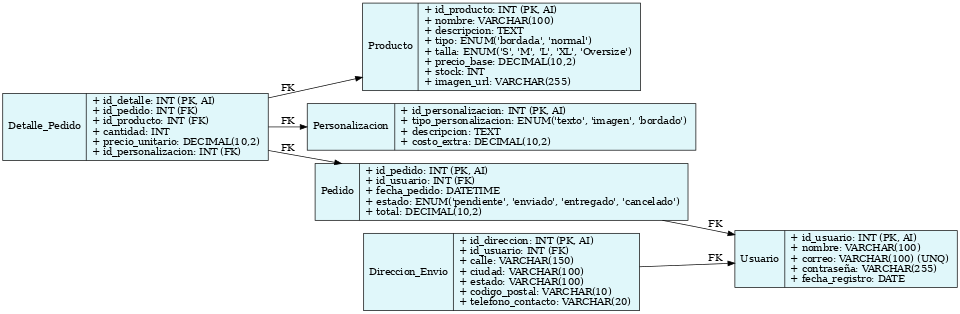

# Modelo Entidad-Relación de la Tienda OverStitch

Este documento contiene el modelo entidad-relación de la tienda online "OverStitch", el cual describe cómo se organiza la información en la base de datos.

Se incluyen entidades como Usuario, Producto, Pedido, Personalización, entre otros, junto con sus relaciones.

-- Tabla: Usuario
CREATE TABLE Usuario (
    id_usuario INT PRIMARY KEY AUTO_INCREMENT,
    nombre VARCHAR(100) NOT NULL,
    correo VARCHAR(100) UNIQUE NOT NULL,
    contraseña VARCHAR(255) NOT NULL,
    fecha_registro DATE NOT NULL
);

-- Tabla: Producto
CREATE TABLE Producto (
    id_producto INT PRIMARY KEY AUTO_INCREMENT,
    nombre VARCHAR(100) NOT NULL,
    descripcion TEXT,
    tipo ENUM('bordada', 'normal') NOT NULL,
    talla ENUM('S', 'M', 'L', 'XL', 'Oversize') NOT NULL,
    precio_base DECIMAL(10,2) NOT NULL,
    stock INT NOT NULL,
    imagen_url VARCHAR(255)
);

-- Tabla: Personalizacion
CREATE TABLE Personalizacion (
    id_personalizacion INT PRIMARY KEY AUTO_INCREMENT,
    tipo_personalizacion ENUM('texto', 'imagen', 'bordado') NOT NULL,
    descripcion TEXT,
    costo_extra DECIMAL(10,2) NOT NULL
);

-- Tabla: Pedido
CREATE TABLE Pedido (
    id_pedido INT PRIMARY KEY AUTO_INCREMENT,
    id_usuario INT NOT NULL,
    fecha_pedido DATETIME NOT NULL,
    estado ENUM('pendiente', 'enviado', 'entregado', 'cancelado') NOT NULL,
    total DECIMAL(10,2) NOT NULL,
    FOREIGN KEY (id_usuario) REFERENCES Usuario(id_usuario)
);

-- Tabla: Detalle_Pedido
CREATE TABLE Detalle_Pedido (
    id_detalle INT PRIMARY KEY AUTO_INCREMENT,
    id_pedido INT NOT NULL,
    id_producto INT NOT NULL,
    cantidad INT NOT NULL,
    precio_unitario DECIMAL(10,2) NOT NULL,
    id_personalizacion INT,
    FOREIGN KEY (id_pedido) REFERENCES Pedido(id_pedido),
    FOREIGN KEY (id_producto) REFERENCES Producto(id_producto),
    FOREIGN KEY (id_personalizacion) REFERENCES Personalizacion(id_personalizacion)
);

-- Tabla: Direccion_Envio
CREATE TABLE Direccion_Envio (
    id_direccion INT PRIMARY KEY AUTO_INCREMENT,
    id_usuario INT NOT NULL,
    calle VARCHAR(150) NOT NULL,
    ciudad VARCHAR(100) NOT NULL,
    estado VARCHAR(100) NOT NULL,
    codigo_postal VARCHAR(10) NOT NULL,
    telefono_contacto VARCHAR(20),
    FOREIGN KEY (id_usuario) REFERENCES Usuario(id_usuario)
);

## Diagrama Relacional

