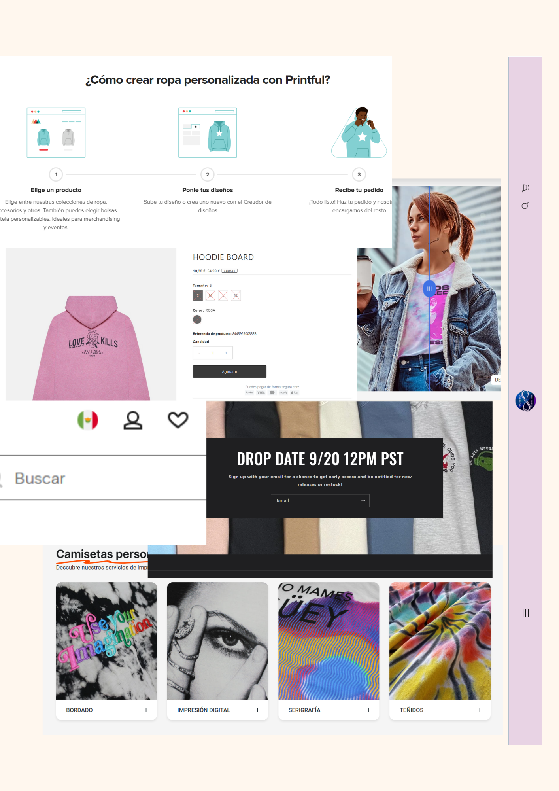

# 🛍️ Proyecto Semestral: Mi Tienda Online

## Nombre de la Tienda
**OVERSTITCH**

## Descripción
**OVERSTITCH** es una tienda online de ropa oversize personalizable que combina diseños frikis con moda urbana minimalista. Ofrecemos sudaderas, camisetas y gorras bordadas con diseños originales o personalizados según lo que el cliente desee. Nuestro enfoque está en la calidad del bordado y en prendas cómodas, modernas y con estilo.

---

## 📦 Inventario de Productos

| ID | Producto        | Tipo       | Precio | Talla     | Stock | Personalizable | Material      |
|----|-----------------|------------|--------|-----------|-------|----------------|----------------|
| 01 | Sudadera Negra  | Sudadera   | $599   | Oversize  | 15    | Sí             | Algodón/Poliéster |
| 02 | Playera Blanca  | T-shirt    | $349   | Oversize  | 20    | Sí             | Algodón        |
| 03 | Gorra Bordada   | Accesorio  | $299   | Unitalla  | 10    | Sí             | Algodón        |
| 04 | Sudadera Anime  | Sudadera   | $699   | Oversize  | 8     | No             | Algodón        |
| 05 | Playera Minimal | T-shirt    | $329   | Oversize  | 12    | No             | Algodón        |

---

## 🖼️ Moodboard

> Este moodboard representa el estilo visual de la tienda: ropa cómoda, tonos neutros, diseño limpio y con inspiración en cultura pop y anime sutil.

---

## 📜 Algoritmo del proceso de compra (Lenguaje natural)

1. El usuario entra al sitio y navega por el catálogo de productos.
2. Selecciona un producto, elige talla y si quiere personalización.
3. Agrega el producto al carrito.
4. Cuando termina de elegir, va al carrito y revisa su pedido.
5. El sistema calcula el total y aplica descuento si aplica.
6. El usuario hace clic en "Comprar".
7. El sistema muestra un mensaje de “procesando compra…”
8. Después de unos segundos, confirma la compra y se muestra un mensaje de éxito.

---

## 🔄 Diagrama de Flujo

